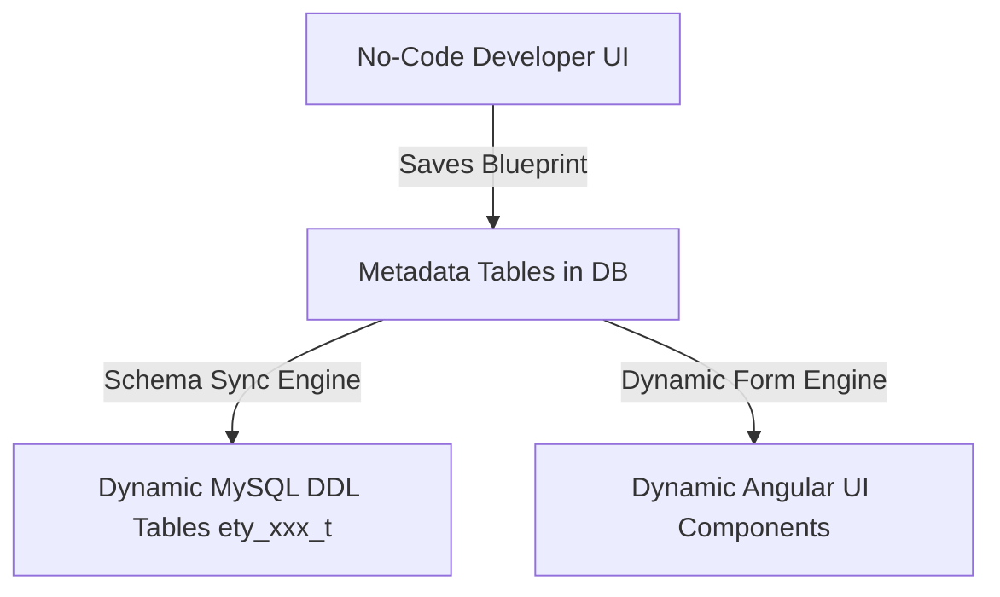

# No-Code Application Builder — Platform Business Logic Reference

This document describes the core business logic of the CRM and Dynamic Entity system from a **No-Code/Low-Code Application Platform (LCAP)** perspective. 

The application is not a hardcoded system with fixed tables (like `leads`, `projects`, etc.). Instead, it is a **dynamic metadata-driven engine** that allows admins to define, generate, customize, and run business data objects entirely at runtime.

---

## 🏛️ 1. The LCAP Concept & Architecture

The entire platform operates on a single unified core rule: **Zero Hardcoded Domain Logic**. 

Instead of creating standard Spring `@Entity` classes or hardcoded Angular routes for every new business object, all definitions are stored as **Metadata**. The database tables, layout configurations, data validators, enrichments, and front-end forms are constructed dynamically from this metadata.



---

## ⚙️ 2. The No-Code Engine Metadata Schema

The platform's blueprint is stored in three main metadata tables:

### 2.1 Entity Blueprints (`ety_entity_t`)
Defines the high-level metadata of a custom business module:
*   `entityCode`: The unique uppercase alphanumeric code (e.g. `CUSTOMER`, `LEAD`, `EXPENSE`). Used as the prefix for the actual database table (`ety_[entityCode]_t`).
*   `entityName`: Human-readable singular/plural label.
*   `entityProperties`: JSON block containing runtime page properties (e.g., `exitOnSave`, `fileGroup`, `enrichmentEvents`).
*   **Query Templates**: Caches dynamically generated DML queries (`gridSelectQuery`, `insertQuery`, `recordSelectQuery`, `recordDeleteQuery`) mapped to the current column set.

### 2.2 Datapoint Fields (`ety_datapoints_t`)
Defines the schema, constraints, and form behaviors of individual columns within an entity:
*   `dataType`: Determines storage type in MySQL (`INT` -> BIGINT, `BOL` -> TINYINT, `DEC` -> DECIMAL, `STR` -> VARCHAR, `LSTR` -> LONGTEXT, `DAT`/`DT` -> DATE/DATETIME, `FILE` -> JSON).
*   `controlType`: Frontend widget mapping (`INPUT`, `DROPDOWN`, `RELATION`, `ATTACHMENT`, `DATE`, `DATETIME`, `SWITCH`).
*   `isMandatory` / `isPrimary`: Enforces non-null columns and dynamic primary keys in the database.
*   `defaultValue`: The initial value stored when creating records (supports expressions like `CURRENT_DATE`, `CURRENT_TIMESTAMP`, `NOW()`, or custom literals).
*   `validations` / `enrichment`: JSON lists specifying conditional validation rules (regex patterns, required checks) and custom value enrichments.

### 2.3 Field Groups (`ety_datapoint_group_t`)
Determines the visual rendering grid structure in the dynamic form:
*   `groupName`: Section header title (e.g., "Personal Details", "Financial Details").
*   `sequenceNo`: Layout order on screen.
*   `groupProperties`: JSON config for responsive sizing (`width`, `noOfColumns`, `noOfColumnsTab`, `noOfColumnsMobile`).

---

## ⚡ 3. Dynamic Schema Engine & Pre-Migration Logic

When a user defines or modifies an entity through the No-Code UI, the Schema Sync Engine translates metadata directly into physical database configurations:

### 3.1 DDL Schema Generation
*   **Create Table**: Builds a dynamic `CREATE TABLE` query combining the data points, mapping data types to correct lengths (e.g. `VARCHAR(255)`), adding mandatory flags (`NOT NULL`), and binding primary keys dynamically.
*   **Modify Table**: Compares current database structure against the old definitions. Automatically determines whether columns need to be added (`ADD COLUMN`) or altered (`MODIFY COLUMN`).

### 3.2 SQL Integrity Pre-Migration
To prevent schema alteration exceptions when a nullable column is modified to be mandatory (`NOT NULL`) on an existing database table that already contains data:
1.  The engine checks if the column is currently present in the database.
2.  If it is being altered to mandatory and a `defaultValue` is defined, the system executes a pre-migration query:
    ```sql
    UPDATE ety_[entityCode]_t SET [columnCode] = [defaultValue] WHERE [columnCode] IS NULL;
    ```
3.  Only after replacing all null values in the database does it run the `ALTER TABLE ... NOT NULL` query, ensuring schema updates never fail due to integrity constraints.

---

## 🎨 4. Metadata-Driven Dynamic UI Engine

The front-end renders all screens at runtime using metadata configs loaded via `/api/entity/entity-definition/{entityCode}`:

*   **Render Component (`app-dynamic-field`)**: Evaluates the `controlType` and dynamically injects the correct input wrapper:
    *   `FieldInputComponent`: Text, emails, passwords, regex validation.
    *   `FieldDropdownComponent`: Maps choices locally from a configured array.
    *   `FieldDatepickerComponent` & `FieldDateTimePickerComponent`: Renders calendar bindings.
    *   `FieldAttachmentComponent`: File uploads linked to local S3 buckets.
*   **Event Normalization**: Dynamic child fields emit change, click, blur, or focus events. These are intercepted and normalized to a clean `{ type: 'change', originalEvent: $event }` layout for unified event processing.
*   **Form Pre-population**:
    *   If `recordMode === 'C'` (Create Mode), the frontend iterates through fields and assigns `defaultValue` (evaluating keywords like `CURRENT_DATE` to a live JS Date object, and mapping `'null'`/`'NULL'` strings to true JS `null` values).
    *   If `recordMode === 'E'` (Edit Mode), the form requests saved records from the database and binds values to the matching datapoints.

---

## 🔒 5. Dynamic Validation & Enrichment Pipeline

Instead of writing hardcoded business logic, the low-code engine executes validations and enrichments Declaratively:

### 5.1 Dynamic Front-End Calculations
*   Calculated fields are resolved using context-aware expression templates.
*   Formulas (e.g., `rate * qty`) are executed securely in the browser using wrapper evaluation containers:
    ```typescript
    const fn = new Function(...fieldCodes, `return ${expression};`);
    return fn(...fieldValues);
    ```

### 5.2 Backend Extensible Bean Execution
*   When executing `saveEntityRecord`, the backend loops through the entity's datapoint rules.
*   It retrieves validator implementations (implementing `IFieldValidator` or `IFieldEnrichment`) directly from the Spring Web Application Context using bean names stored in metadata (e.g., `MandatoryValidator`, `UniqueCodeEnrichmentAction`).
*   This makes validations completely pluggable without modifying the core service structure.

---

## 📂 6. Dynamic ETL / File Exchange Engine

Data import/export is completely generic and adapts to the active column definitions:

*   **Excel/CSV Template Generation**: Dynamically constructs blank headers matching the active datapoint list, applying formatting markers for date, numeric, or boolean fields.
*   **Generic Import Parsing**:
    *   Reads XLSX (via Apache POI) or CSV (via state-machine line parser).
    *   Maps raw spreadsheet cells directly to active database columns.
    *   Performs backend date pattern parsing, injects tenant company codes, evaluates enrichments, and logs the execution output in the upload log (`ety_entity_file_upload_log_t`).

---

## ⏰ 7. Dynamic Actions & Scheduler Engine

The platform includes a dynamic trigger and execution engine that handles updates, notifications, and scheduled events:

### 7.1 Action Master (`ety_action_t`)
Actions represent simple, reusable execution tasks:
*   **Action Types**: `DATA_UPDATE` (executes database writes), `DATA_SELECT` (database reads), or `NOTIFY` (sends alerts).
*   **Triggers**: Actions can be bound to buttons in entity lists/forms or configured inside schedulers.

### 7.2 Scheduler Master (`ety_scheduler_t`)
Schedulers represent cron-based background jobs managed by Spring's task executor:
*   **DATA_UPDATE Schedulers**: Periodically execute custom SQL queries (`schedulerQuery`) on the database.
*   **NOTIFY Schedulers**: Dispatch alerts at configured cron schedules.
*   **ACTION_MASTER Schedulers**: Trigger an Action Master:
    *   *With a custom query*: Runs the `schedulerQuery` to fetch a list of rows, and iterates over them, triggering the Action Master for each row's context.
    *   *Without a query*: Triggers the Action Master exactly once with an empty context map.

---

## 8. Updates & Corrections Log

> Append findings here. Format: `[YYYY-MM-DD] Category: Description`

```
[2026-06-22] Entity System Enrichment & Event Normalization: Fixed double-nesting issues on child event emitters and normalized custom/framework UI events (which don't emit standard event types) to consistent '{ type: "change" }' structures. Evaluators were upgraded from global eval to context-aware new Function wrappers to evaluate formulas in scope of current form data points.
[2026-06-22] Entity Dropdowns & Chip list: Fixed issues with dropdown values chips by converting the popup component to bind to reactive properties, serializing/cloning configurations to prevent modifications during dialog transitions, and normalising dropdown lists (supporting strings, objects, etc) within the custom component dropdown and adding search filters.
[2026-06-22] Entity Grid Server-Side Sorting: Replaced native click handlers on column header elements with Angular Material's native (matSortChange) event listener directly on the table wrapper. Integrated backend data-service controller and service to parse, validate, and apply user-selected sort columns and direction, bypassing the default sorts.
[2026-06-22] Server-Side Excel & CSV File Uploads/Exports: Implemented backend parsing of both Excel (via Apache POI) and CSV (via custom Java parser) files uploaded via POST, with support for automatic and manual column mappings and date validations. Implemented template downloads (blank formats) and data exports (with existing table records) for both Excel (.xlsx) and CSV (.csv) formats, accessible via the main list header and inside the side uploader drawer. Resolved and injected `companyCode` context into all imported rows.
[2026-06-26] Pre-Migration DDL Updates: Added a pre-migration query execution block in `EntityService.java` that runs `UPDATE <table_name> SET <col> = <defVal> WHERE <col> IS NULL` before altering a column to `NOT NULL` (mandatory). This ensures that existing database records are updated to the configured default value, preventing MySQL constraints crashes.
[2026-06-26] Default Values & Form Loading: Implemented frontend record form default value pre-population inside `entity-form-entry-component.component.ts`. Supports date expressions (`CURRENT_DATE`, `CURRENT_TIMESTAMP`), booleans, strings, and numeric constants. Enabled explicit `null` defaults if the value is set to `'null'` or `'NULL'`.
[2026-06-26] Date Null-Safety: Fixed a `NullPointerException` in `EntityService.java` when saving null, empty, or `"null"` string date/datetime fields, safely converting them to database NULLs instead of invoking `.equals("")` on null values.
[2026-06-26] Scheduler Validation & Robust Execution: Added reactive validation dynamically toggling required constraints on query and action selections in `entity-scheduler.component.ts`. Wrapped scheduler query executions in `DynamicJobService.java` to support running Action Master triggers with empty SQL select filters, and ensured cron job successes record execution metadata in MySQL.
```
